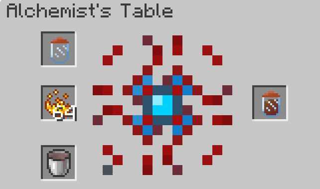

# alchemyconstruct

Create potions dynamically using alchemy construct!

First create a alchemy table!

Then make a alchemic jar

Now create a processor

An alchemy table needs 3 things:
- A Jar/Concoction
- A Base Ingridient
- A Bucket Of Elementium

To get elementium we need to process a water bucket with a fermented spider eye

Every potion needs a base ingridient:
- Strength                                = Blaze Powder
- Weakness                                = Reverted Blaze Powder ( Process blaze powder and fermented spider eye )
- Speed                                   = Sugar
- Slowness               		  = Reverted Sugar ( Process sugar and fermented spider eye )
- Jump Boost	                          = Rabbits Foot
- Haste                                   = Amplified Sugar ( Process sugar and glowstone dust )
- Mining Fatigue                          = Reverted Amplified Sugar ( Process amplified sugar and fermented spider eye )
- Regeneration                            = Ghast Tear
- Wither	                          = Withered Mix
- Instant Health			  = Glistering Melon
- Instant Damage			  = Reverted Glistering Melon	( Process glistering melon and fermented spider eye )
- Poison                                  = Fermented Spider Eye
- Resistance                              = Duromale Shell
- Night Vision                            = Golden Carrot
- Blindness                               = Reverted Golden Carrot ( Process golden carrot and fermented spider eye )
- Fire Resistance                         = Magma Cream
- Water Breathing                         = Pufferfish
- Invisibility                            = Amplified Reverted Golden Carrot
- Luck                                    = Emerald
- Bad Luck                                = Jewel Of Misfortune ( Process emerald and fermented spider eye )
- Levitation                              = Shulker Shell
- Combustion                              = Magmatic Mix ( Process magma cream and blaze powder )
- Slow Falling                            = Phantom Membrane
- Glowing                                 = Glowstone **Block**
- Jeweled ( Increases all effect length ) = Diamond
- Splash Potions 			  = Gunpowder

You can put an alchemical concoction back into the alchemical table to get more effects or a stronger one.
Theres a limit of level 3 for most effects.

Process a sword with a concoction to apply the effects to the sword ( Entities player hits gets the effects )

You can wash sand with a washer to get gold nuggets , nautilus shells and duromale shells 

Withered Mix is used to create wither potions

